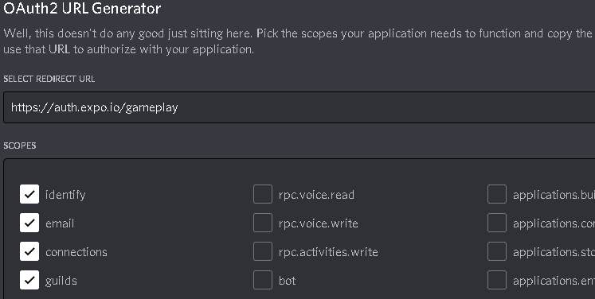

<h1 align="center">
  
</h1>

<p align="center">
  

 
</p>


## :computer: Projeto:
Crie grupos para jogar seus games favoritos com seus amigos com esse App que possui autenticação com Discord.

## :hammer_and_wrench: Features:
- Autenticação Social OAuth2 com servidor do Discord.
- Obtém perfil do usuário cadastro no Discord (username e avatar);
- Lista os servidores do Discord que o usuário faz parte;
- Permite realizar o agendamento de partidas;
- Permite filtrar as partidas por categoria;
- Exibe se a partida foi agendada em um servidor próprio (anfitrião) ou em servidores de outros (convidado);
- Compartilha o convite para ingressar no servidor do usuário;
- Permite redirecionar o usuário para o seu próprio servidor;
- Disponibiliza a função de Logout.

## :sparkles: Tecnologias:
- React Native
- Typescript
- Expo
- Context API
- Async Storage
- Vector Icons
- React Native Svg e Svg Transform
- Axios
- Gradient colors
- OAuth2 Discord
- Expo Google Fonts
- React Navigation Stack
- React Native Gesture Handler
- Expo Authentication
- React Native Share
- Deep Link

## :bookmark::pencil2: Layout:
Você pode visualizar o layout do projeto através [deste link](https://www.figma.com/file/0kv33XYjvOgvKGKHBaiR07/GamePlay-NLW-Together?node-id=58913%3A83). É necessário ter conta no [Figma](http://figma.com/) para acessá-lo.

## :memo::scroll: Referências interessantes:
- Autenticação por meio de login através da API do Discord
- Rotas customizadas, conforme o estado da autenticação
- Uso da _Context API_ para propagar os dados do usuário através de todas as telas
- Interface dinâmica, diferente conforme o usuário é proprietário do servidor ou um membro
- Uso do recurso de _Image Background_ da biblioteca _react-native_ na página _AppointmentDetails_

## :rocket: Getting Started:
Run **`yarn`** or **`npm install`** to download and install project dependencies.<br/>
Run **`expo start`** to start the project's _development server_.<br/>
Open the expo app on your mobile device and read the QR code.<br/>

Create a `New Application` on the [Discord server](https://discord.com/developers/applications) to obtain authentication credentials.<br/>


Create a copy of the `.env.example` file and remove the `.example`.<br/>
Copy the _API OAuth2 URL_ and paste the corresponding values in your `.env` file.
 
```cl
REDIRECT_URI=
SCOPE=
RESPONSE_TYPE=
CLIENT_ID=
CDN_IMAGE=
```

## 📄 Licença:
Esse projeto está sob a licença MIT. Veja o arquivo [LICENSE](LICENSE) para mais detalhes.
<br/>

<div align="center">
  <small>Projeto desenvolvido durante o evento NLW #06 - Junho/2021</small>

  [](https://www.linkedin.com/in/paulo-kruger-costa)
</div>
